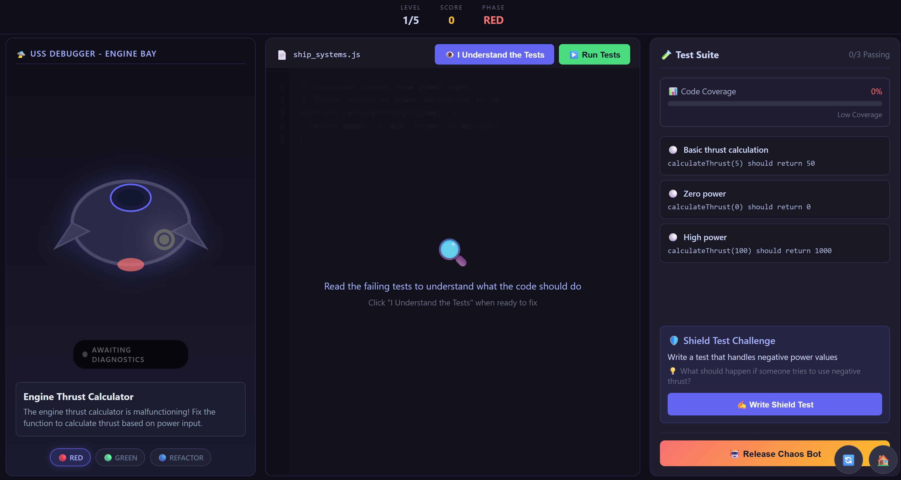
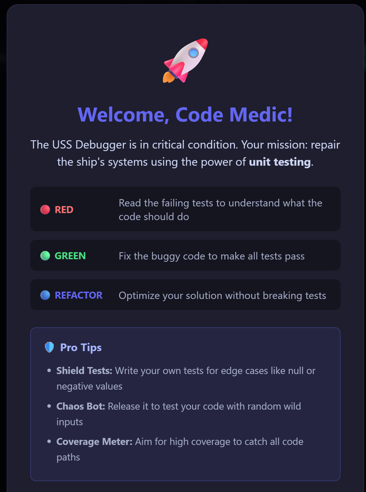

# The Bug Fixer's Gauntlet 🚀

An educational browser-based puzzle game that teaches unit testing fundamentals through the **Red-Green-Refactor** cycle. Students act as "Code Medics" repairing a broken spaceship!



## 🎮 Game Overview

### The Interface

The screen is split into three main panels:

- **World View**: A visual of the spaceship component you're repairing
- **Code Editor**: A simplified IDE showing buggy code to fix
- **Test Suite**: Test cases with Pass/Fail status lights



### Gameplay Loop (The Levels)

Each level progresses through three phases:

1. **🔴 Red Phase (Observation)**: Read failing tests to understand what the code *should* do
2. **🟢 Green Phase (Implementation)**: Fix the code to make all tests pass
3. **🔵 Refactor Phase (Optimization)**: Improve your solution without breaking tests

## 🎯 Learning Mechanics

- **Edge Case Bosses**: Write "Shield Tests" to handle null inputs and edge cases
- **Chaos Bot**: Random inputs that crash unprotected code
- **Code Coverage Meter**: Visual feedback on which code paths are tested
- **Instant Feedback**: See diffs showing `Expected` vs `Received` values

## 🛠️ Tech Stack

- **React 18** with TypeScript
- **Vite** for fast development
- **Custom Test Runner** for browser-based code execution

## 🚀 Getting Started

### Prerequisites

- Node.js 18+ 
- npm or yarn

### Installation

```bash
# Install dependencies
npm install

# Start development server
npm run dev
```

### Building for Production

```bash
npm run build
npm run preview
```

## 📁 Project Structure

```
src/
├── components/           # React UI components
│   ├── WorldView/       # Spaceship visualization
│   ├── CodeEditor/      # Code editing panel  
│   ├── TestSuite/       # Test cases display
│   └── GameUI/          # HUD, phase indicators
├── context/             # React context for game state
├── engine/              # Game logic
│   ├── CodeExecutor.ts  # Safe eval wrapper
│   ├── TestRunner.ts    # Test execution engine
│   └── CoverageTracker.ts
├── levels/              # Level definitions
├── types/               # TypeScript interfaces
└── styles/              # Global styles
```

## 🎓 For Educators

This game is designed to teach:

- The Red-Green-Refactor TDD cycle
- Writing and understanding test assertions
- Edge case handling
- Code coverage concepts
- The importance of readable, maintainable code

### Adding Custom Levels

Edit `src/levels/index.ts` to add new challenges:

```typescript
{
  id: 6,
  name: 'Your Level Name',
  description: 'Description of the problem',
  component: 'ComponentName',
  initialCode: `// Buggy code here`,
  solutionCode: `// Working solution`,
  tests: [
    {
      id: '6-1',
      name: 'Test name',
      code: 'functionName(input)',
      expectedOutput: expectedValue,
      description: 'What the test checks',
    },
  ],
}
```

## 📝 License

MIT
